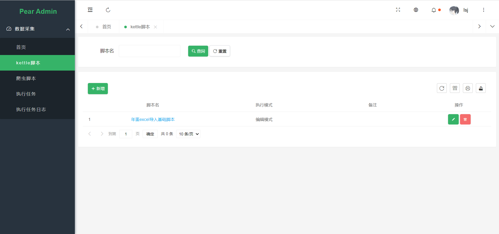
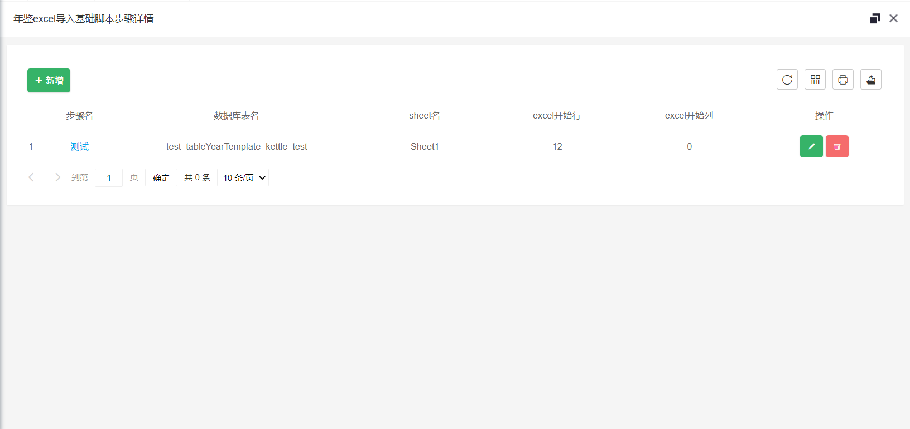
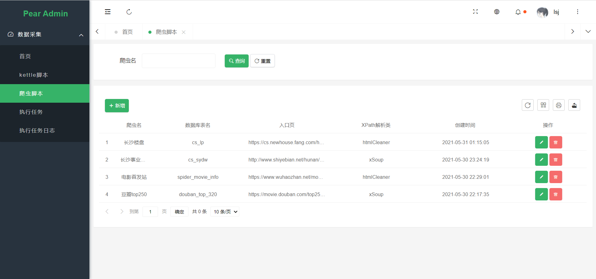
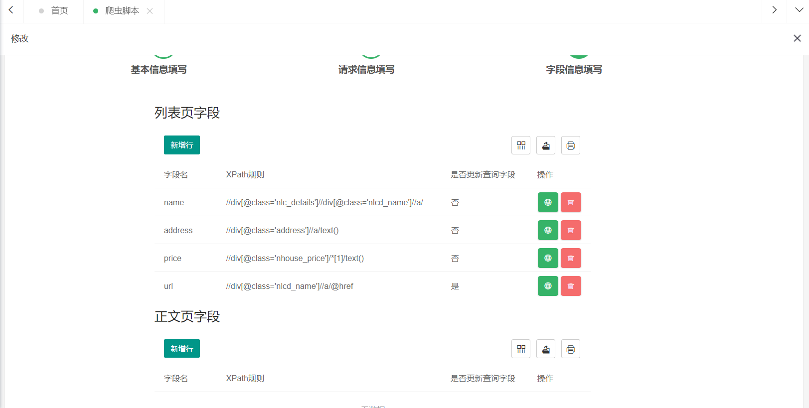

cattle

#### 介绍
简单的数据处理web平台，只需在界面配置，即可实现数据入库操作。
目前支持的组件有：
1. 爬虫
2. kettle脚本

#### 软件架构

##### 后端
kettle
springboot
mybatis-plus
mysql
webMagic
redis

##### 前端
pear admin（layui）

#### 执行环境配置

##### 环境要求
1. kettle执行脚本 需要把kettle下的plugins文件夹下的内容都拷贝下来，否则无法执行kettle脚本，在KettlePluginInit中配置地址
2. JDK 1.8+
3. kettle执行基础脚本需先执行sql目录下的batch_insert_log、batch_insert_error_log、kettle执行函数。

##### 项目描述

- kettle

  - 进入如下

    

  - 第一层为新增kettle脚本，如果当前执行模式是编辑模式，则脚本名能点击设置自定义excel文件参数

    

  - 在这个kettle下创建的步骤都是单独的步骤，且都是按照上层的脚本信息来执行。

  - 点击步骤名来设置自定义字段。

    注意事项：

    1. 数据库表名在脚本中设置的默认替换值为<b>```` tableYearTemplate ````</b>  ，当前默认脚本的处理规则为，以excel名字为替换值来区分年份。

- spider

  - 进入如下：

    

    - 爬虫脚本在新增或者修改时能页面调试

      

    - 爬虫需要执行会根据入口页和列表页的数据自动扫描添加下一步的扫描url
      - 目前支持数据增量更新（选择全量更新不会校验规则）
        - 判断规则：
          1. 如果有正文页需要下载，则会先过滤正文页的url（url过滤只过滤正文页url，不过滤列表页）
          2. 所有需要爬取的字段数据拼接，hash算出4个值，redis bitmap过滤
          3. 如果有字段的查询更新填”是“，则会在前两次的基础上，再根据字段的值去数据库中查询来更新或者插入
        - 注意事项：
          1. 需要确保字段xpath规则解析出的字段是一一对应的，不能出现数量不一致的情况，这种情况会在日志中体现且不会保存数据。
          2. 是否更新查询字段只有在**增量**下才会生效。

#### 后续可能需要优化和新增的地方

- 前端执行取消计划。
- 组件热加载，目前实现了包扫描和jar扫描，修改一下可实现热加载，需要修改的地方为如何方便关联到对应的组件信息表，以及组件执行需要的信息如何拼接。

- Kettle
  1. 目前未完成数据库自定义设置界面，可以在数据库配置，注意的是名字要与kettle脚本内的数据库表名字相同。
  2. 在步骤中需要上传excel，可能需要一个步骤处理多个excel（统计年鉴多年份导入）。
- Spider
  1. 目前保存的线程为起的单个的执行线程，当启动的爬虫较多时可能出现延迟问题。
  2. 在修改执行保存线程的时候需要考虑，保存信息如何实时保存数据，不实时保存可能内存占用过大，或者OOM问题。
  3. 目前爬虫的数据过滤是用的bitmap，目前的hash算法算出的值较大，则引起的问题是bitmap占用内存很多，但实际数据分布不均（非连续的），需要优化。
  4. 数据保存只针对了未创建表自动创建表结构，但是如果字段发生改变需要自行修改表结构，后续可以对这块做比对之类的。

#### 组件描述

- 执行组件

  **KettleScript**与**SpiderScript** 是组件的执行单位，新增组件参考这两个类。

- 执行上下问

  **ProcessContent** 为执行上下文，其中包括put错误和警告两个方法，在组件内执行的异常需要在ProcessContent中新增。

- 计划流程

  **JobEventPublish**推送事件，会将CattleJob包装成event类交给**CattleJobEventRun**来执行。

#### 完成计划
- [x] 完善所有功能的测试方法
    - [x] 爬虫
    - [x] kettle
    - [x] 脚本执行类
- [ ] kettle脚本执行组件
    - [x] 执行kettle脚本
    - [x] 解析excel文件并导入数据库
    - [x] 自定义执行数据库
    - [ ] 多excel导入
- [x] 爬虫组件（基于webMagic）
    - [x] 执行自定义爬虫
    - [x] 数据保存类别（全量、增量规则）
    - [x] redis整合，布隆过滤器（数据增量保存）
- [x] 优化通用组件执行方法，以插件形式导入
- [ ] Quartz定时任务整合
- [ ] web界面
    - [x] 各脚本执行参数配置
        - [x] kettle
        - [x] spider
    - [ ] 新增定时任务
    - [x] 执行状态查询
    - [ ] 取消执行计划

附录

1. [WebMagic文档](http://webmagic.io/docs/zh/)

2. [layuI文档](https://www.layui.com/doc/modules/table.html)